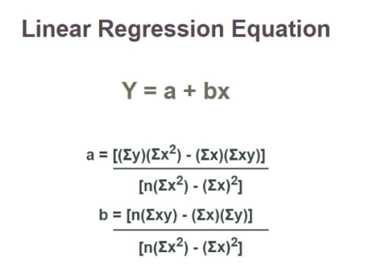

---

### Key Topics

**[Linear Regression](#what-is-linear-regression)**  <br>
**[Derivation of Simple Linear Regression](#derivation)** <br>
**[Multiple Linear Regression](#multiple-linear-regression)** <br>
**[Loss Function](#loss-function)** <br>


---

<br>

### What is Linear Regression

Linear Regression is one of the simplest and most widely used machine learning algorithms. It is used to **predict a numerical value** (like house prices, exam scores, or temperature) based on one or more input features (like size of the house, hours studied, or humidity).

Think of it as drawing a straight line through data points to find the best relationship between inputs (features) and outputs (target values).


### Key Idea: The Line of Best Fit

Imagine we have some data points on a graph:

- On the X-axis (horizontal), you have an input feature (e.g., "hours studied").
- On the Y-axis (vertical), you have the output (e.g., "exam score").

If we plot these points, they might look scattered. Linear Regression tries to find the **best straight line** that fits these points. This line is called the **line of best fit**.

The equation of this line looks like this:

$$
Y = mX + c
$$

Where:
- $Y$ = Predicted output (e.g., exam score)
- $X$ = Input feature (e.g., hours studied)
- $m$ = Slope of the line (how steep the line is)
- $c$ = Intercept (where the line crosses the Y-axis)

  

<br>


### How Does It Work?

1. **Goal**: Find the best values for $m$ (slope) and $c$ (intercept) so that the line fits the data well.
2. **Error Calculation**: The algorithm calculates how far each data point is from the line. This distance is called the **error**.
3. **Minimize Error**: The algorithm adjusts $m$ and $c$ to minimize the total error. This process is called **optimization**.

The most common method to minimize the error is called **Least Squares**, which minimizes the sum of the squared distances between the actual data points and the predicted values on the line.

### Example: Predicting Exam Scores

Let’s say you want to predict a student's exam score based on the number of hours they studied.

| Hours Studied ($X$) | Exam Score ($Y$) |
|----------------------|-------------------|
| 1                    | 50                |
| 2                    | 60                |
| 3                    | 70                |
| 4                    | 80                |

1. Plot these points on a graph.
2. Draw a straight line that best fits these points.
3. Use the equation of the line ($Y = mX + c$) to predict scores for new values of $X$ (hours studied).

For example, if the line equation is $Y = 10X + 40$:
- If a student studies for 5 hours ($X = 5$), their predicted score would be:
  $$
  Y = 10(5) + 40 = 90
  $$

### Why Is It Called "Linear"?

It’s called **linear** because the relationship between the input ($X$) and output ($Y$) is represented by a straight line. If you have multiple input features (e.g., hours studied, sleep hours, etc.), the concept extends to higher dimensions, but the idea remains the same: finding the best-fitting "plane" or "hyperplane."


### When to Use Linear Regression?

- When the relationship between the input(s) and output is roughly linear.
- When you need to predict a continuous numerical value (not categories like "yes/no").
- When the dataset is not too complex (for complex data, other algorithms may work better).


### Summary

Linear Regression is like finding the best straight line that describes how one thing (input) affects another (output). It’s simple, easy to understand, and a great starting point for learning machine learning.

<br>

---

<br>

### <a id="loss-function"></a>Loss Function

The most commonly used loss function in Linear Regression is the Mean Squared Error (MSE).


### Mean Squared Error (MSE)

**Mean Squared Error (MSE)** is a metric that tells us how well our linear regression model fits the data. It measures the average squared difference between actual and predicted values. A lower MSE indicates better model performance.

$$
MSE = \frac{1}{n} \sum_{i=1}^{n} (y_i - \hat{y}_i)^2
$$

Where:
- yi = Actual values (observed data)
- ŷi = Predicted values (from the model)
- n = Number of data points


### Why Do We Square the Errors?
- Removes negative signs: Squaring ensures all errors are positive, preventing cancellation.
- Penalizes large errors: Larger deviations contribute more to the error, forcing the model to focus on minimizing large mistakes.


### Implementing MSE in Python


```python
import numpy as np

# Actual and predicted values
y_actual = np.array([50, 60, 70, 80])
y_predicted = np.array([52, 58, 69, 81])

# Compute Mean Squared Error
mse = np.mean((y_actual - y_predicted) ** 2)
print("Mean Squared Error:", mse)
```

### Output
```
Mean Squared Error: 2.5
```

This means, on average, our model’s predictions are **2.5 squared units** away from the actual values.

<br>

### **How is MSE Used in Model Training?**

MSE (Mean Squared Error) is used as the loss function to evaluate and optimize a linear regression model. Here's how it works compactly:

#### Objective: Minimize the MSE, which measures the average squared difference between actual yi and predicted ŷi values:
   
$$
MSE = \frac{1}{n} \sum_{i=1}^{n} (y_i - \hat{y}_i)^2
$$

#### Model Representation: The linear regression model predicts outputs using ŷ = mx + c ; where m (slope) and c (intercept) are the parameters to optimize.
   

#### Optimization via Gradient Descent**:
   - Compute gradients of MSE with respect to m and c:
     
$$
\frac{\partial MSE}{\partial m} = -\frac{2}{n} \sum X(y - \hat{y}), \quad \frac{\partial MSE}{\partial c} = -\frac{2}{n} \sum (y - \hat{y})
$$

#### Update parameters iteratively:

     
$$
m = m - \alpha \frac{\partial MSE}{\partial m}, \quad c = c - \alpha \frac{\partial MSE}{\partial c}
$$

where α is the learning rate. <br>
     

Convergence: Repeat updates until MSE stops decreasing significantly, indicating the best-fit line. The optimized parameters m and c minimize prediction errors, resulting in a model that fits the data well.


<br>

```python
import numpy as np
import matplotlib.pyplot as plt

# Sample dataset (Hours studied vs. Exam Score)
X = np.array([1, 2, 3, 4, 5])  # Independent variable (Hours studied)
y = np.array([50, 60, 70, 80, 90])  # Dependent variable (Exam Score)

# Initialize parameters
m = 0  # Slope
c = 0  # Intercept
learning_rate = 0.01
epochs = 1000  # Number of iterations

# Gradient Descent Algorithm
n = len(X)
for _ in range(epochs):
    y_pred = m * X + c  # Predicted values
    mse = np.mean((y - y_pred) ** 2)  # Compute MSE
    
    # Compute gradients
    dm = (-2/n) * sum(X * (y - y_pred))
    dc = (-2/n) * sum(y - y_pred)
    
    # Update parameters
    m -= learning_rate * dm
    c -= learning_rate * dc

print(f"Final Equation: y = {m:.2f}x + {c:.2f}")
print("Final MSE:", mse)

# Plot results
plt.scatter(X, y, color='red', label="Actual Data")
plt.plot(X, m*X + c, color='blue', label="Predicted Line")
plt.legend()
plt.show()
```

---

### **Output**
```
Final Equation: y = 10.00x + 40.00
Final MSE: 0.0
```


🔹 The **blue line** represents our model's predictions.  
🔹 The **red points** are the actual data points.  
🔹 The **Final MSE is 0**, meaning the model perfectly fits the data.


## Key Takeaways
- MSE helps us measure prediction error in linear regression.
- Gradient Descent uses MSE** to adjust the model parameters iteratively.
- A lower MSE means better model performance.
- MSE is not perfect – it can be sensitive to outliers, so sometimes MAE or Huber Loss is used instead for loss functions.


<br> 

---


<br> 


### <a id="derivation"></a>Derivation

#### Linear regression is a fundamental statistical method used to model the relationship between a dependent variable y and one or more independent variables x. In simple linear regression, we aim to find the best-fitting straight line that minimizes the error between the observed data points and the predicted values. The equation of the line is given by:

$$
y = \beta_0 + \beta_1 x
$$

where:
- y: Dependent variable (response)
- y: Independent variable (predictor)
- β0: Intercept (value of y when x = 0)
- β1: Slope (rate of change of y with respect to x)

The goal is to derive the values of β0 and β1 that minimize the sum of squared errors (SSE). Let’s go through the derivation step by step.

### The Sum of Squared Errors (SSE)
The error for a single data point is the difference between the observed value yi and the predicted value ȳi = β0 + β1xi. The total error is minimized by minimizing the sum of squared errors:


#### The Sum of Squared Errors (SSE) is defined as:

$$
SSE = \sum_{i=1}^n \left( y_i - (\beta_0 + \beta_1 x_i) \right)^2
$$


### Minimize SSE with Respect to β0 and β1
To find the values of β0 and β1 that minimize SSE, we take partial derivatives of SSE with respect to β0 and β1, set them to zero, and solve for β0 and β1.

#### Partial Derivative with Respect to β0 :
$$
\frac{\partial SSE}{\partial \beta_0} = \frac{\partial}{\partial \beta_0} \sum_{i=1}^n \left( y_i - (\beta_0 + \beta_1 x_i) \right)^2
$$

#### Using the chain rule:
$$
\frac{\partial SSE}{\partial \beta_0} = \sum_{i=1}^n 2 \left( y_i - (\beta_0 + \beta_1 x_i) \right)(-1)
$$

#### Simplifying:
$$
\frac{\partial SSE}{\partial \beta_0} = -2 \sum_{i=1}^n \left( y_i - \beta_0 - \beta_1 x_i \right)
$$

#### Setting ∂SSE/∂β0 = 0:
$$
\sum_{i=1}^n \left( y_i - \beta_0 - \beta_1 x_i \right) = 0
$$

#### Rearranging:
$$
\sum_{i=1}^n y_i = n \beta_0 + \beta_1 \sum_{i=1}^n x_i
$$

#### Divide through by n:
$$
\bar{y} = \beta_0 + \beta_1 \bar{x}
$$

#### This gives us the first equation:
$$
\beta_0 = \bar{y} - \beta_1 \bar{x}
$$

#### Partial Derivative with Respect to  β1 :
$$
\frac{\partial SSE}{\partial \beta_1} = \frac{\partial}{\partial \beta_1} \sum_{i=1}^n \left( y_i - (\beta_0 + \beta_1 x_i) \right)^2
$$

#### Using the chain rule: 
$$
\frac{\partial SSE}{\partial \beta_1} = \sum_{i=1}^n 2 \left( y_i - (\beta_0 + \beta_1 x_i) \right)(-x_i)
$$

#### Simplifying:
$$
\frac{\partial SSE}{\partial \beta_1} = -2 \sum_{i=1}^n x_i \left( y_i - \beta_0 - \beta_1 x_i \right)
$$

#### Set ∂SSE/∂β1 = 0 :
$$
\sum_{i=1}^n x_i \left( y_i - \beta_0 - \beta_1 x_i \right) = 0
$$

#### Substitute β0 = ȳ - β1x into the equation:
$$
\sum_{i=1}^n x_i \left( y_i - (\bar{y} - \beta_1 \bar{x}) - \beta_1 x_i \right) = 0
$$

#### Simplifying:
$$
\sum_{i=1}^n x_i \left( y_i - \bar{y} + \beta_1 \bar{x} - \beta_1 x_i \right) = 0
$$

#### Distribute x1:
$$
\sum_{i=1}^n x_i (y_i - \bar{y}) + \beta_1 \sum_{i=1}^n x_i (\bar{x} - x_i) = 0
$$

#### Split terms:
$$
\sum_{i=1}^n x_i (y_i - \bar{y}) = \beta_1 \sum_{i=1}^n x_i (x_i - \bar{x})
$$

#### Solve for β1:
$$
\beta_1 = \frac{\sum_{i=1}^n x_i (y_i - \bar{y})}{\sum_{i=1}^n x_i (x_i - \bar{x})}
$$


### Simplifying the Expressions
We can rewrite the numerator and denominator in terms of covariance and variance:
- #### Covariance:
$$ \text{Cov}(x, y) = \frac{1}{n} \sum_{i=1}^n (x_i - \bar{x})(y_i - \bar{y}) $$
- #### Variance:
$$ \text{Var}(x) = \frac{1}{n} \sum_{i=1}^n (x_i - \bar{x})^2 $$

#### Thus:
$$
\beta_1 = \frac{\text{Cov}(x, y)}{\text{Var}(x)}
$$

#### And from earlier:
$$
\beta_0 = \bar{y} - \beta_1 \bar{x}
$$


#### The linear regression coefficients are:
$$
\boxed{\beta_1 = \frac{\sum_{i=1}^n (x_i - \bar{x})(y_i - \bar{y})}{\sum_{i=1}^n (x_i - \bar{x})^2}}
$$
$$
\boxed{\beta_0 = \bar{y} - \beta_1 \bar{x}}
$$

These are the formulas for the slope β1 and intercept β0 of the best-fit line in simple linear regression.

- The working formula for linear regression




<br>

---

<br>


### <a id="multiple-linear-regression"></a>Multiple Linear Regression

### **What Is Multiple Linear Regression (MLR)?**  
Multiple Linear Regression (MLR), or multiple regression, is a statistical method used to predict a dependent variable based on multiple independent variables. It extends Ordinary Least Squares (OLS) regression, which only involves one independent variable, by incorporating several explanatory factors to improve accuracy.  


### **MLR Formula & Calculation**  
MLR predicts a dependent variable using multiple independent variables.  <br>
### **Formula for MLR**
$$
y_i = \beta_0 + \beta_1 x_{i1} + \beta_2 x_{i2} + \dots + \beta_p x_{ip} + \epsilon
$$

Where:
- yi: The **dependent variable** (the outcome or response variable we are trying to predict).
- xi1, xi2, ..., xip: The **independent variables** (also called predictors or explanatory variables) that influence yi.
- β0 : The **intercept**, which represents the value of yi when all independent variables are zero.
- β1 , β2 , \..., βp: The **regression coefficients** that quantify the effect of each independent variable on yi. These coefficients tell us how much yi changes for a one-unit change in the corresponding x, holding all other variables constant.
- ϵ : The **error term** (or residuals), which accounts for the difference between the observed value of yi and the value predicted by the model.

<br>

## **MLR Properties**  
MLR helps analysts understand relationships between multiple factors and their influence on an outcome. It assumes:  
1. A linear relationship between dependent and independent variables.  
2. Independent variables are not highly correlated.  
3. Observations are randomly selected.  
4. Residuals (errors) are normally distributed with constant variance.  

<br>

### **R-Squared (R^2) in MLR**  
R^2 measures how well the independent variables explain the variation in the dependent variable. It ranges from 0 to 1:  
- 0 = No explanatory power.  
- 1 = Perfect prediction.  

However, adding more variables always increases R^2 , even if they don’t significantly impact the outcome.  

<br>

## **Example of MLR**  
An analyst wants to determine what influences ExxonMobil’s (XOM) stock price. Possible independent variables include:  
- **Interest rates** (xi1)  
- **Oil prices** (xi2)  
- **S&P 500 Index** (xi3)  
- **Oil futures prices** (xi4)  

<br>

## **MLR vs. Simple Linear Regression**  
- **Simple Linear Regression:** Uses one independent variable to predict an outcome.  
- **Multiple Linear Regression:** Uses two or more independent variables to improve prediction accuracy.
- While simple regressions can be done manually, MLR calculations are complex and typically require statistical software like Excel, Python, R, or SPSS.  

<br>

### **Why Use MLR?**  
- Real-world outcomes are rarely influenced by a single factor.  
- MLR provides a more accurate representation of complex relationships.  
- It helps in finance, economics, and social sciences to predict trends and test theories.

  
<br>

## **MLR in Finance**  
In financial modeling, MLR helps:  
- Analyze stock price movements.  
- Predict company valuations.  
- Expand models like the **Fama-French Three-Factor Model**, which extends the Capital Asset Pricing Model (CAPM) to include size and value risk factors.  

<br>

## **Linear vs. Nonlinear Multiple Regression**  
- **Linear MLR:** Assumes a straight-line relationship between variables.  
- **Nonlinear MLR:** Uses curved models like logistic regression or quadratic regression when relationships are not strictly linear.  


---
