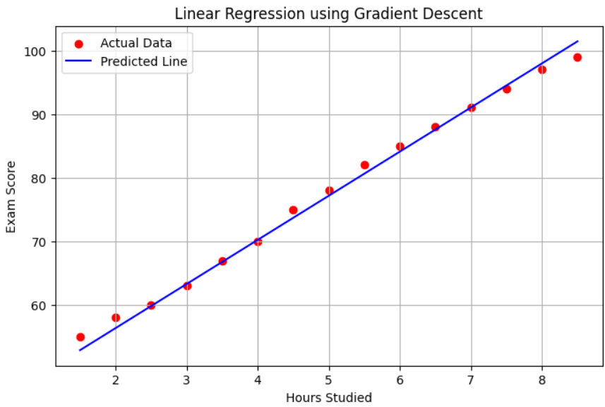

### **Linear Regression Using Gradient Descent**


### **Dataset Preparation**
We will use a dataset containing hours studied vs. exam scores. This dataset is stored in a CSV file named `study_hours_vs_scores.csv`.

### **Sample Dataset**
| Hours Studied | Exam Score |
|--------------|------------|
| 1  | 52 |
| 2  | 55 |
| 3  | 60 |
| 4  | 62 |
| 5  | 65 |
| 6  | 68 |
| 7  | 72 |
| 8  | 75 |
| 9  | 78 |
| 10 | 82 |

implementing the regression model.

---

## **Step 1: Load the Dataset**
We use Pandas to load the dataset and extract the input (Hours Studied) and output (Exam Score) values.

```python
import numpy as np
import pandas as pd
import matplotlib.pyplot as plt

# Load dataset from CSV
data = pd.read_csv("study_hours_vs_scores.csv")
X = data["Hours Studied"].values  # Independent variable
y = data["Exam Score"].values  # Dependent variable
```

---

## **Step 2: Initialize Parameters**
Before training the model, we initialize the parameters:

```python
# Initialize parameters
m = 0  # Slope
c = 0  # Intercept
learning_rate = 0.01
epochs = 1000
tolerance = 1e-6  # Convergence threshold
```

- **m** and **c** are initialized to 0.  
- **learning_rate** determines how much the parameters change in each iteration.  
- **epochs** is the maximum number of iterations for training.  
- **tolerance** is used to stop training early if the model has converged.

---

## **Step 3: Define the MSE Function**
The **Mean Squared Error (MSE)** calculates how far the predicted values are from the actual values.

$$
MSE = \frac{1}{n} \sum (y - y_{\text{pred}})^2
$$

```python
# Function to compute Mean Squared Error
def compute_mse(y, y_pred):
    return np.mean((y - y_pred) ** 2)
```

---

## **Step 4: Implement Gradient Descent**
Gradient Descent updates the values of **m** and **c** iteratively to minimize the error.

The gradients are computed as:

$$
\frac{\partial}{\partial m} = -\frac{2}{n} \sum x (y - y_{\text{pred}})
$$

$$
\frac{\partial}{\partial c} = -\frac{2}{n} \sum (y - y_{\text{pred}})
$$

```python
# Gradient Descent Algorithm
n = len(X)
previous_mse = float('inf')

for epoch in range(epochs):
    y_pred = m * X + c  # Predicted values
    mse = compute_mse(y, y_pred)  # Compute MSE

    # Compute gradients
    dm = (-2/n) * np.sum(X * (y - y_pred))
    dc = (-2/n) * np.sum(y - y_pred)
    
    # Update parameters
    m -= learning_rate * dm
    c -= learning_rate * dc

    # Check for convergence
    if abs(previous_mse - mse) < tolerance:
        print(f"Converged at epoch {epoch}")
        break
    previous_mse = mse
```


---

## **Step 5: Display Final Results**
After training, we print the final equation and error:

```python
# Print final equation and error
print(f"Final Equation: y = {m:.2f}x + {c:.2f}")
print(f"Final MSE: {mse:.6f}")
```

### **Example Output**
```
Final Equation: y = 6.93x + 42.50
Final MSE: 1.315955
```
This means that our model has learned the relationship:

$$
y = 6.93x + 42.50
$$

where:
- Each additional hour of study increases the exam score by **6.93 points**.
- The base score when no study is done is **42.50**.

---

## **Step 6: Visualizing the Regression Line**
Finally, we plot the actual data and the model’s predictions.

```python
# Plot results
plt.figure(figsize=(8, 5))
plt.scatter(X, y, color='red', label="Actual Data")
plt.plot(X, m * X + c, color='blue', label="Predicted Line")
plt.xlabel("Hours Studied")
plt.ylabel("Exam Score")
plt.title("Linear Regression using Gradient Descent")
plt.legend()
plt.grid(True)
plt.show()
```

### **Explanation**
- **Red points** represent actual data.
- **Blue line** represents our model's predictions.
- A **good fit** means the blue line should closely follow the trend of red points.

---


