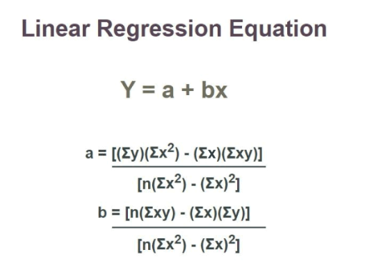

### Key Topics

**[Simple Linear Regression](#simple-linear-regression)**  <br>
**[Loss Function](#loss-function)** <br>
**[Derivation of Simple Linear Regression](#derivation)** <br>
**[Multiple Linear Regression](#multiple-linear-regression)** <br>
**[Polynomial Regression](#polynomial-regression)** <br>


---

<br>

## Simple Linear Regression

Simple Linear Regression is one of the simplest and most widely used machine learning algorithms. It is used to **predict a numerical value** (like house prices, exam scores, or temperature) based on one or more input features (like size of the house, hours studied, or humidity).

Think of it as drawing a straight line through data points to find the best relationship between inputs (features) and outputs (target values).


#### Key Idea: The Line of Best Fit

Imagine we have some data points on a graph:

- On the X-axis (horizontal), you have an input feature (e.g., "hours studied").
- On the Y-axis (vertical), you have the output (e.g., "exam score").

If we plot these points, they might look scattered. Linear Regression tries to find the **best straight line** that fits these points. This line is called the **line of best fit**.

The equation of this line looks like this:

$$
Y = mX + c
$$

Where:
- $Y$ = Predicted output (e.g., exam score)
- $X$ = Input feature (e.g., hours studied)
- $m$ = Slope of the line (how steep the line is)
- $c$ = Intercept (where the line crosses the Y-axis)

  

<br>


#### How Does It Work?

1. **Goal**: Find the best values for $m$ (slope) and $c$ (intercept) so that the line fits the data well.
2. **Error Calculation**: The algorithm calculates how far each data point is from the line. This distance is called the **error**.
3. **Minimize Error**: The algorithm adjusts $m$ and $c$ to minimize the total error. This process is called **optimization**.

The common methods to minimize the error are **MSE** and **Least Squares**

#### Example: Predicting Exam Scores

Let’s say you want to predict a student's exam score based on the number of hours they studied.

| Hours Studied ($X$) | Exam Score ($Y$) |
|----------------------|-------------------|
| 1                    | 50                |
| 2                    | 60                |
| 3                    | 70                |
| 4                    | 80                |

1. Plot these points on a graph.
2. Draw a straight line that best fits these points.
3. Use the equation of the line (Y = mX + c) to predict scores for new values of X (hours studied).

For example, if the line equation is Y = 10X + 40:
- If a student studies for 5 hours (X = 5), their predicted score would be:

$$
  Y = 10(5) + 40 = 90
$$

#### Why Is It Called "Linear"?

It’s called **linear** because the relationship between the input X and output Y is represented by a straight line. If you have multiple input features (e.g., hours studied, sleep hours, etc.), the concept extends to higher dimensions, but the idea remains the same: finding the best-fitting "plane" or "hyperplane."


#### When to Use Linear Regression?

- When the relationship between the input(s) and output is roughly linear.
- When you need to predict a continuous numerical value (not categories like "yes/no").
- When the dataset is not too complex (for complex data, other algorithms may work better).


#### Summary

Linear Regression is like finding the best straight line that describes how one thing (input) affects another (output). It’s simple, easy to understand, and a great starting point for learning machine learning.

<br>
<br>

---

<br>
<br>


# Loss Function

The most commonly used loss function in Linear Regression is the Mean Squared Error (MSE).


### Mean Squared Error (MSE)

Mean Squared Error is a metric that tells us how well our linear regression model fits the data. It measures the average squared difference between actual and predicted values. A lower MSE indicates better model performance.

$$
MSE = \frac{1}{n} \sum_{i=1}^{n} (y_i - \hat{y}_i)^2
$$

Where:
- yi = Actual values (observed data)
- ŷi = Predicted values (from the model)
- n = Number of data points


#### Why Do We Square the Errors?
- Removes negative signs: Squaring ensures all errors are positive, preventing cancellation.
- Penalizes large errors: Larger deviations contribute more to the error, forcing the model to focus on minimizing large mistakes.


#### Implementing MSE in Python


```python
import numpy as np

# Actual and predicted values
y_actual = np.array([50, 60, 70, 80])
y_predicted = np.array([52, 58, 69, 81])

# Compute Mean Squared Error
mse = np.mean((y_actual - y_predicted) ** 2)
print("Mean Squared Error:", mse)
```

#### Output
```
Mean Squared Error: 2.5
```

This means, on average, our model’s predictions are **2.5 squared units** away from the actual values.

<br>

#### **How is MSE Used in Model Training?**

MSE (Mean Squared Error) is used as the loss function to evaluate and optimize a linear regression model. Here's how it works compactly:

#### Objective: Minimize the MSE, which measures the average squared difference between actual yi and predicted ŷi values:
   
$$
MSE = \frac{1}{n} \sum_{i=1}^{n} (y_i - \hat{y}_i)^2
$$

#### Model Representation: The linear regression model predicts outputs using ŷ = mx + c ; where m (slope) and c (intercept) are the parameters to optimize.
   

#### Optimization via Gradient Descent**:
   - Compute gradients of MSE with respect to m and c:
     
$$
\frac{\partial MSE}{\partial m} = -\frac{2}{n} \sum X(y - \hat{y}), \quad \frac{\partial MSE}{\partial c} = -\frac{2}{n} \sum (y - \hat{y})
$$

#### Update parameters iteratively:

     
$$
m = m - \alpha \frac{\partial MSE}{\partial m}, \quad c = c - \alpha \frac{\partial MSE}{\partial c}
$$

where α is the learning rate. <br>
     

Convergence: Repeat updates until MSE stops decreasing significantly, indicating the best-fit line. The optimized parameters m and c minimize prediction errors, resulting in a model that fits the data well.


<br>


<br>


🔹 **The red line represents the model's predictions (best-fit line).**  
🔹 **The blue points are the actual data points.**  
🔹 **The MSE is NOT 0 because the points do not lie exactly on the line.**  <br>

<br>

If MSE were truly **0**, all the blue points would be exactly on the red line (a perfect fit). But in the image, we see some deviation, meaning there is some error.  


<br><br>

**Least Squares**:  
   - It minimizes the sum of squared residuals:
   - 
$$
     \sum_{i=1}^{n} (y_i - \hat{y}_i)^2
$$

   - This is the foundation of **Ordinary Least Squares (OLS)** regression, the most widely used method in linear regression.

#### Key Takeaways
- **MSE (Mean Squared Error)** measures how far predictions are from actual values.  
- **Least Squares** is a method that finds the best-fit line by minimizing the sum of squared errors.  
- **Least Squares and MSE are connected**—Least Squares minimizes MSE in linear regression.  
- **Least Squares gives an exact solution** using a mathematical formula.  
- **MSE is sensitive to outliers**, so other methods like MAE or Huber Loss are sometimes used.  


<br>
<br>

---

<br>
<br>


# Derivation

Linear regression is a fundamental statistical method used to model the relationship between a dependent variable y and one or more independent variables x. In simple linear regression, we aim to find the best-fitting straight line that minimizes the error between the observed data points and the predicted values. The equation of the line is given by:

$$
y = \beta_0 + \beta_1 x
$$

where:
- y: Dependent variable (response)
- y: Independent variable (predictor)
- β0: Intercept (value of y when x = 0)
- β1: Slope (rate of change of y with respect to x)

The goal is to derive the values of β0 and β1 that minimize the sum of squared errors (SSE). Let’s go through the derivation step by step.

### The Sum of Squared Errors (SSE)
The error for a single data point is the difference between the observed value yi and the predicted value ȳi = β0 + β1xi. The total error is minimized by minimizing the sum of squared errors:


#### The Sum of Squared Errors (SSE) is defined as:

$$
SSE = \sum_{i=1}^n \left( y_i - (\beta_0 + \beta_1 x_i) \right)^2
$$


### Minimize SSE with Respect to β0 and β1
To find the values of β0 and β1 that minimize SSE, we take partial derivatives of SSE with respect to β0 and β1, set them to zero, and solve for β0 and β1.

Partial Derivative with Respect to β0 :

$$
\frac{\partial SSE}{\partial \beta_0} = \frac{\partial}{\partial \beta_0} \sum_{i=1}^n \left( y_i - (\beta_0 + \beta_1 x_i) \right)^2
$$

Using the chain rule:

$$
\frac{\partial SSE}{\partial \beta_0} = \sum_{i=1}^n 2 \left( y_i - (\beta_0 + \beta_1 x_i) \right)(-1)
$$

Simplifying:

$$
\frac{\partial SSE}{\partial \beta_0} = -2 \sum_{i=1}^n \left( y_i - \beta_0 - \beta_1 x_i \right)
$$

Setting ∂SSE/∂β0 = 0:

$$
\sum_{i=1}^n \left( y_i - \beta_0 - \beta_1 x_i \right) = 0
$$

Rearranging:

$$
\sum_{i=1}^n y_i = n \beta_0 + \beta_1 \sum_{i=1}^n x_i
$$

Divide through by n:

$$
\bar{y} = \beta_0 + \beta_1 \bar{x}
$$

This gives us the first equation:

$$
\beta_0 = \bar{y} - \beta_1 \bar{x}
$$

Partial Derivative with Respect to  β1 :

$$
\frac{\partial SSE}{\partial \beta_1} = \frac{\partial}{\partial \beta_1} \sum_{i=1}^n \left( y_i - (\beta_0 + \beta_1 x_i) \right)^2
$$

Using the chain rule: 

$$
\frac{\partial SSE}{\partial \beta_1} = \sum_{i=1}^n 2 \left( y_i - (\beta_0 + \beta_1 x_i) \right)(-x_i)
$$

Simplifying:

$$
\frac{\partial SSE}{\partial \beta_1} = -2 \sum_{i=1}^n x_i \left( y_i - \beta_0 - \beta_1 x_i \right)
$$

Set ∂SSE/∂β1 = 0 :

$$
\sum_{i=1}^n x_i \left( y_i - \beta_0 - \beta_1 x_i \right) = 0
$$

Substitute β0 = ȳ - β1x into the equation:

$$
\sum_{i=1}^n x_i \left( y_i - (\bar{y} - \beta_1 \bar{x}) - \beta_1 x_i \right) = 0
$$

Simplifying:

$$
\sum_{i=1}^n x_i \left( y_i - \bar{y} + \beta_1 \bar{x} - \beta_1 x_i \right) = 0
$$

Distribute x1:

$$
\sum_{i=1}^n x_i (y_i - \bar{y}) + \beta_1 \sum_{i=1}^n x_i (\bar{x} - x_i) = 0
$$

Split terms:

$$
\sum_{i=1}^n x_i (y_i - \bar{y}) = \beta_1 \sum_{i=1}^n x_i (x_i - \bar{x})
$$

#### Solve for β1:
$$
\beta_1 = \frac{\sum_{i=1}^n x_i (y_i - \bar{y})}{\sum_{i=1}^n x_i (x_i - \bar{x})}
$$


### Simplifying the Expressions
We can rewrite the numerator and denominator in terms of covariance and variance:
- #### Covariance:
$$ \text{Cov}(x, y) = \frac{1}{n} \sum_{i=1}^n (x_i - \bar{x})(y_i - \bar{y}) $$
- #### Variance:
$$ \text{Var}(x) = \frac{1}{n} \sum_{i=1}^n (x_i - \bar{x})^2 $$

#### Thus:
$$
\beta_1 = \frac{\text{Cov}(x, y)}{\text{Var}(x)}
$$

#### And from earlier:
$$
\beta_0 = \bar{y} - \beta_1 \bar{x}
$$


#### The linear regression coefficients are:
$$
\boxed{\beta_1 = \frac{\sum_{i=1}^n (x_i - \bar{x})(y_i - \bar{y})}{\sum_{i=1}^n (x_i - \bar{x})^2}}
$$
$$
\boxed{\beta_0 = \bar{y} - \beta_1 \bar{x}}
$$

These are the formulas for the slope β1 and intercept β0 of the best-fit line in simple linear regression.

- The working formula for linear regression




<br>
<br>

---

<br>
<br>


# Multiple Linear Regression

Multiple Linear Regression (MLR) is an extension of simple linear regression that models the relationship between a dependent variable Y and multiple independent variables X1, X2, ..., XJ. This approach is crucial when a single predictor cannot adequately explain the variation in the target variable.

### Why Multiple Linear Regression?
In real-world scenarios, most outcomes are influenced by multiple factors rather than a single predictor. For example:

- Housing prices depend on location, size, number of bedrooms, etc.
- Student performance is influenced by study time, school quality, prior knowledge, etc.
- Sales revenue may depend on advertising, seasonality, and customer demographics.

To capture these complex relationships, we use multiple predictors in our regression model.

## Mathematical Formulation of Multiple Linear Regression

### Equation of the Model
In simple linear regression, we use the equation:

$$
\[ y = \beta_0 + \beta_1 x + \epsilon \]
$$

For multiple predictors x1, x2, ..., xj, the model extends to:

$$
\[ y = \beta_0 + \beta_1 x_1 + \beta_2 x_2 + \dots + \beta_J x_J + \epsilon \]
$$

where:
- y is the dependent variable (response),
- x1, x2, ..., xj are the independent variables (predictors),
- β0 is the intercept,
- β1, β2, ..., βJ are the coefficients for each predictor,
- ϵ is the error term.

<br>


<br>

### Matrix Representation of Multiple Linear Regression
To generalize the model for n observations, we use vector notation:

#### **Response Vector Y (Target Values)**
This is just a column of all the observed y values:  

$$
Y =
\begin{bmatrix}
y_1 \\
y_2 \\
\vdots \\
y_n
\end{bmatrix}
$$

For example, if we are predicting house prices for 3 houses, we might have:  

$$
Y =
\begin{bmatrix}
250000 \\
300000 \\
400000
\end{bmatrix}
$$


#### **Design Matrix X (Feature Values)**
Each row represents one observation (a house, a student, etc.), and each column is a different feature.  

$$
X =
\begin{bmatrix}
1 & x_{1,1} & x_{1,2} & \dots & x_{1,j} \\
1 & x_{2,1} & x_{2,2} & \dots & x_{2,j} \\
\vdots & \vdots & \vdots & \ddots & \vdots \\
1 & x_{n,1} & x_{n,2} & \dots & x_{n,j}
\end{bmatrix}
$$

- The **first column** is always **1** (for the intercept β.  
- Each column after that contains values for a predictor.  

Example with **2 predictors** (square footage and bedrooms):  

$$
X =
\begin{bmatrix}
1 & 1500 & 3 \\
1 & 2000 & 4 \\
1 & 2500 & 4
\end{bmatrix}
$$

#### **Parameter Vector β (Coefficients)**
This is the set of unknowns we are trying to find:  

$$
\beta =
\begin{bmatrix}
\beta_0 \\
\beta_1 \\
\vdots \\
\beta_j
\end{bmatrix}
$$

For our example:  

$$
\beta =
\begin{bmatrix}
\text{base price} \\
\text{price per square foot} \\
\text{price per bedroom}
\end{bmatrix}
$$

Thus, the multiple linear regression model can be written concisely as:

$$
\[ Y = X\beta + \epsilon \]
$$

#### Solving for β (Parameter Estimation)
We estimate β using the **least squares method**, which finds the best-fitting values:  

$$
\hat{\beta} = (X^T X)^{-1} X^T Y
$$

- X^T: Transpose of the design matrix.  
- (X^T * X)^(-1): Inverse of (X^T * X).  
- (X^T * Y): Matrix multiplication.  

Computers use this formula to quickly compute the best values of β.  


<br><br>

#### **R-Squared in MLR**  
R^2 measures how well the independent variables explain the variation in the dependent variable. It ranges from 0 to 1:  
- 0 = No explanatory power.  
- 1 = Perfect prediction.  

However, adding more variables always increases R^2 , even if they don’t significantly impact the outcome.  

<br>
<br>

#### **MLR vs. Simple Linear Regression**  
- **Simple Linear Regression:** Uses one independent variable to predict an outcome.  
- **Multiple Linear Regression:** Uses two or more independent variables to improve prediction accuracy.
- While simple regressions can be done manually, MLR calculations are complex and typically require statistical software like Excel, Python, R, or SPSS.  

<br>
<br>

#### **Linear vs. Nonlinear Multiple Regression**  
- **Linear MLR:** Assumes a straight-line relationship between variables.  
- **Nonlinear MLR:** Uses curved models like logistic regression or quadratic regression when relationships are not strictly linear.  


<br>
<br>

---

<br>
<br>


# Polynomial Regression

Polynomial regression is an extension of linear regression that allows us to model **nonlinear relationships** between input variables (predictors) and the output (response). While simple linear regression fits a straight line to data, polynomial regression fits a **curved line** by incorporating higher-degree terms of the predictor variables. This makes it a **flexible** and **widely used** technique in machine learning and statistics.  


<br> <br>

## **Mathematical Formulation of Polynomial Regression**  

In a standard **linear regression** model, we have the equation:  

$$
y = \beta_0 + \beta_1 x + \epsilon
$$

where:  
- y is the dependent variable,  
- x is the independent variable,  
- β0 (intercept) and β1 (slope) are the parameters,  
- ϵ is the error term.  

However, in **polynomial regression**, we introduce higher-degree terms:  

$$
y = \beta_0 + \beta_1 x + \beta_2 x^2 + \beta_3 x^3 + \dots + \beta_M x^M + \epsilon
$$

where:  
- M is the **degree** of the polynomial,  
- Each power of x acts as a separate predictor variable.

<br>


<br> <br>

## **Matrix Representation of Polynomial Regression**  

Polynomial regression can be rewritten in **matrix form**, which allows us to solve for the parameters efficiently. Given n observations, we define:

#### **Response Vector Y**
This contains all observed output values:

$$
Y =
\begin{bmatrix}
y_1 \\
y_2 \\
\vdots \\
y_n
\end{bmatrix}
$$

For example, if we have 3 observations:  

$$
Y =
\begin{bmatrix}
2 \\
5 \\
10
\end{bmatrix}
$$

#### **Design Matrix X**
Each row represents one observation, and each column represents a power of x (up to degree M):

$$
X =
\begin{bmatrix}
1 & x_1 & x_1^2 & \dots & x_1^M \\
1 & x_2 & x_2^2 & \dots & x_2^M \\
\vdots & \vdots & \vdots & \ddots & \vdots \\
1 & x_n & x_n^2 & \dots & x_n^M
\end{bmatrix}
$$

Example for 3 observations and a quadratic model (M=2):

$$
X =
\begin{bmatrix}
1 & 1 & 1^2 \\
1 & 2 & 2^2 \\
1 & 3 & 3^2
\end{bmatrix} =
\begin{bmatrix}
1 & 1 & 1 \\
1 & 2 & 4 \\
1 & 3 & 9
\end{bmatrix}
$$

#### **Parameter Vector β **
This holds the unknown coefficients:

$$
\beta =
\begin{bmatrix}
\beta_0 \\
\beta_1 \\
\beta_2 \\
\vdots \\
\beta_M
\end{bmatrix}
$$

For our quadratic example:

$$
\beta =
\begin{bmatrix}
\beta_0 \\
\beta_1 \\
\beta_2
\end{bmatrix}
$$

Thus, the polynomial regression model can be written in matrix notation as:

$$
Y = X \beta + \epsilon
$$

where **Xβ** represents the predicted values and ϵ is the error vector.

### **Solving for β**  

To estimate the optimal parameters β hat, we minimize the **Mean Squared Error (MSE)**:

$$
MSE(\beta) = \frac{1}{n} \sum_{i=1}^{n} (y_i - \hat{y}_i)^2
$$

Using **vector calculus**, the solution for β hat is given by the **normal equation**:

$$
\hat{\beta} = (\mathbf{X}^T \mathbf{X})^{-1} \mathbf{X}^T \mathbf{Y}
$$

This equation provides the least squares estimates of the polynomial regression coefficients.


<br> <br>


## **Generalized Polynomial Regression**  

Polynomial regression can be extended to multiple predictors, allowing for more complex relationships.

### **1. Multiple Predictors (Multivariable Polynomial Regression)**  
If we have multiple predictors X1, X2, ..., XJ, the polynomial regression model takes the form:

$$
y = \beta_0 + \beta_1 x_1 + \beta_2 x_1^2 + \dots + \beta_M x_1^M + \beta_{M+1} x_2 + \dots + \beta_{M+MJ} x_J^M + \epsilon
$$

The corresponding **design matrix X** would look like:

$$
X =
\begin{bmatrix}
1 & x_{11} & x_{11}^2 & \dots & x_{11}^M & x_{12} & x_{12}^2 & \dots & x_{1J}^M \\
1 & x_{21} & x_{21}^2 & \dots & x_{21}^M & x_{22} & x_{22}^2 & \dots & x_{2J}^M \\
\vdots & \vdots & \vdots & \ddots & \vdots & \vdots & \vdots & \ddots & \vdots \\
1 & x_{n1} & x_{n1}^2 & \dots & x_{n1}^M & x_{n2} & x_{n2}^2 & \dots & x_{nJ}^M
\end{bmatrix}
$$

This allows polynomial regression to model **multiple predictor variables** at the same time.

### **2. Interaction Terms (Cross Terms)**  
Polynomial regression can also capture interactions between predictors by including **cross terms**. If we have two predictors x1 and x2, we can include terms like:

$$
y = \beta_0 + \beta_1 x_1 + \beta_2 x_1^2 + \beta_3 x_2 + \beta_4 x_2^2 + \beta_5 (x_1 x_2) + \beta_6 (x_1 x_2)^2 + \dots + \epsilon
$$

Each interaction term x1 x2 is treated as a separate predictor.


<br> <br>


## **Conclusion**  

Polynomial regression is a **powerful and flexible technique** that extends linear regression by introducing higher-degree terms. It is useful for capturing **nonlinear relationships** while still leveraging the simplicity of linear regression. However, **choosing the right polynomial degree** is crucial to balancing bias and variance. With proper tuning, polynomial regression can be an effective tool in predictive modeling across various domains.  


