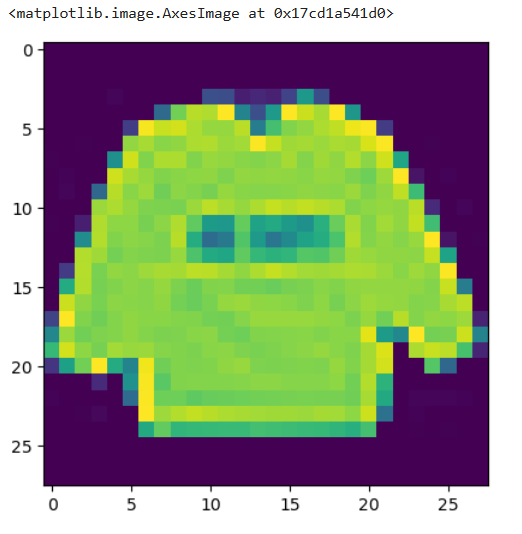
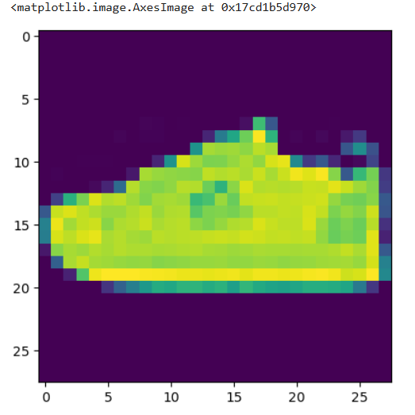

# Image Classification using Logistic Regression

## Introduction
This project implements an image classification model using Logistic Regression on the Fashion MNIST dataset. The dataset consists of grayscale images of fashion items, which are converted into pixel values for training the model.

## Dataset
The Fashion MNIST dataset contains 60,000 training images and 10,000 test images, each represented as a 28x28 grayscale pixel matrix (flattened into 784 features). The dataset includes the following labels:

| Label | Class Name    |
|-------|-------------|
| 0     | T-shirt/top |
| 1     | Trouser     |
| 2     | Pullover    |
| 3     | Dress       |
| 4     | Coat        |
| 5     | Sandal      |
| 6     | Shirt       |
| 7     | Sneaker     |
| 8     | Bag         |
| 9     | Ankle boot  |


## Dataset Loading
The dataset contains **60,000 training images** and **10,000 test images**. Each image is **28x28 pixels**, converted into a **784-dimensional feature vector**.

```python
import pandas as pd  

# Load the training dataset
train = pd.read_csv('fashion-mnist_train.csv')  # Training dataset
test = pd.read_csv('fashion-mnist_test.csv')    # Testing dataset
train
```
## Sample Data

Here is a sample of the training dataset:

| label | pixel1 | pixel2 | pixel3 | pixel4 | pixel5 | pixel6 | pixel7 | pixel8 | pixel9 | ... | pixel775 | pixel776 | pixel777 | pixel778 | pixel779 | pixel780 | pixel781 | pixel782 | pixel783 | pixel784 |
|-------|--------|--------|--------|--------|--------|--------|--------|--------|--------|-----|----------|----------|----------|----------|----------|----------|----------|----------|----------|----------|
| 0     | 2      | 0      | 0      | 0      | 0      | 0      | 0      | 0      | 0      | ... | 0        | 0        | 0        | 0        | 0        | 0        | 0        | 0        | 0        | 0        |
| 1     | 9      | 0      | 0      | 0      | 0      | 0      | 0      | 0      | 0      | ... | 0        | 0        | 0        | 0        | 0        | 0        | 0        | 0        | 0        | 0        |
| 2     | 6      | 0      | 0      | 0      | 0      | 0      | 0      | 5      | 0      | ... | 0        | 0        | 30       | 43       | 0        | 0        | 0        | 0        | 0        | 0        |
| 3     | 0      | 0      | 0      | 0      | 1      | 2      | 0      | 0      | 0      | ... | 3        | 0        | 0        | 0        | 1        | 0        | 0        | 0        | 0        | 0        |
| 4     | 3      | 0      | 0      | 0      | 0      | 0      | 0      | 0      | 0      | ... | 0        | 0        | 0        | 0        | 0        | 0        | 0        | 0        | 0        | 0        |

...

## Dataset Details

- **Total Rows:** 60,000
- **Columns:**
  - `label`: The target variable (values range from 0 to 9, representing the class labels)
  - `pixel1` to `pixel784`: Represent the pixel values for each image. These are flattened 28x28 pixel images where each pixel's intensity is represented by an integer value.
  
Note: The full dataset contains 60,000 rows and 785 columns, but only a portion of it is shown here.

```python
test
```
## Sample Data

Here is a sample of the testing dataset:

| label | pixel1 | pixel2 | pixel3 | pixel4 | pixel5 | pixel6 | pixel7 | pixel8 | pixel9 | ... | pixel775 | pixel776 | pixel777 | pixel778 | pixel779 | pixel780 | pixel781 | pixel782 | pixel783 | pixel784 |
|-------|--------|--------|--------|--------|--------|--------|--------|--------|--------|-----|----------|----------|----------|----------|----------|----------|----------|----------|----------|----------|
| 0     | 0      | 0      | 0      | 0      | 0      | 0      | 0      | 0      | 9      | 8   | ...      | 103      | 87       | 56       | 0        | 0        | 0        | 0        | 0        | 0        | 0        |
| 1     | 1      | 0      | 0      | 0      | 0      | 0      | 0      | 0      | 0      | 0   | ...      | 34       | 0        | 0        | 0        | 0        | 0        | 0        | 0        | 0        | 0        |
| 2     | 2      | 0      | 0      | 0      | 0      | 0      | 14     | 53     | 99     | 0   | ...      | 0        | 0        | 0        | 63       | 53       | 31       | 0        | 0        | 0        | 0        |
| 3     | 2      | 0      | 0      | 0      | 0      | 0      | 0      | 0      | 0      | 0   | ...      | 137      | 126      | 140      | 0        | 133      | 224      | 222      | 56       | 0        | 0        |
| 4     | 3      | 0      | 0      | 0      | 0      | 0      | 0      | 0      | 0      | 0   | ...      | 0        | 0        | 0        | 0        | 0        | 0        | 0        | 0        | 0        | 0        |

...

## Dataset Details

- **Total Rows:** 10,000
- **Columns:**
  - `label`: The target variable (values range from 0 to 9, representing the class labels for different categories of images).
  - `pixel1` to `pixel784`: Represent the pixel values for each image. These are flattened 28x28 pixel images where each pixel's intensity is represented by an integer value.

Note: The full dataset contains 10,000 rows and 785 columns, but only a portion of it is shown here.

```python
X_train = train.drop(columns = 'label')
Y_train = train['label']

X_test = test.drop(columns = 'label')
Y_test = test['label']

X_train
```
Note: .drop(columns = 'column name') used to delete a column


## Sample Data

Here is a sample training dataset after deleting column 'label':

| pixel1 | pixel2 | pixel3 | pixel4 | pixel5 | pixel6 | pixel7 | pixel8 | pixel9 | ... | pixel775 | pixel776 | pixel777 | pixel778 | pixel779 | pixel780 | pixel781 | pixel782 | pixel783 | pixel784 |
|--------|--------|--------|--------|--------|--------|--------|--------|--------|-----|----------|----------|----------|----------|----------|----------|----------|----------|----------|----------|
 2      | 0      | 0      | 0      | 0      | 0      | 0      | 0      | 0      | ... | 0        | 0        | 0        | 0        | 0        | 0        | 0        | 0        | 0        | 0        |
| 1     | 9      | 0      | 0      | 0      | 0      | 0      | 0      | 0      | 0      | ... | 0        | 0        | 0        | 0        | 0        | 0        | 0        | 0        | 0        | 0        |
| 2     | 6      | 0      | 0      | 0      | 0      | 0      | 0      | 5      | 0      | ... | 0        | 0        | 30       | 43       | 0        | 0        | 0        | 0        | 0        | 0        |
| 3     | 0      | 0      | 0      | 0      | 1      | 2      | 0      | 0      | 0      | ... | 3        | 0        | 0        | 0        | 1        | 0        | 0        | 0        | 0        | 0        |
| 4     | 3      | 0      | 0      | 0      | 0      | 0      | 0      | 0      | 0      | ... | 0        | 0        | 0        | 0        | 0        | 0        | 0        | 0        | 0        | 0        |

...


**Note:** The `label` column has been omitted, and only pixel data from `pixel1` to `pixel784` are shown.


```python
Y_test
```

## Sample Data

Here is a sample testing dataset which has only one column ('label'):

| Index  | Label |
|--------|-------|
| 0      | 0     |
| 1      | 1     |
| 2      | 2     |
| 3      | 2     |
| 4      | 3     |
| ...    | ...   |
| 9995   | 0     |
| 9996   | 6     |
| 9997   | 8     |
| 9998   | 8     |
| 9999   | 1     |

**Note:** The label values represent the digits from 0 to 9 that correspond to each image in the dataset.


## For image we need 3 dimension. But the data is one dimension. So here are some steps to form a image from this pixels.

# made a 2D array

```python
X_train_list = X_train.values.tolist()
X_train_list
```

## Sample Data

Here is a sample of the dataset as a 2D list of pixel values:

```python
dataset = [
    [0, 0, 0, 0, 0, 0, 0, 0, 0, 0, 0, 0, 0, 0, 0, 0, 0, 0, 0, 0, 0, 0, 0, 0, 0, 0, 0, 0, 0, 0, 0, 0, 0, 0, 0, 0, 0, 0, 0, 0, 0, 0, 0, 0, 0, 0, 0, 0, 0, 0, 0, 0, 0, 0, 0, 0, 0, 0, 0, 0, 0, 0, 0, 0, 0, 0, 0, 0, 0, 0, 0, 0, 0, 0, 4, 0, 0, 0, 0, 0, 62, 61, 21, 29, 23, 51, 136, 61, 0, 0, 0, 0, 0, 0, 0, 0, 0, 0, 0, 0, 0, 88, 201, 228, 225, 255, 115, 62, 137, 255, 235, 222, 255, 135, 0, 0, 0, 0, 0, 0, 0, 0, 0, 0, 0, 0, 0, 47, 252, 234, 238, 224, 215, 215, 229, 108, 180, 207, 214, 224, 231, 249, 254, 45, 0, 0, 0, 0, 0, 0, 0, 0, 1, 0, 0, 214, 222, 210, 213, 224, 225, 217, 220, 254, 233, 219, 221, 217, 223, 221, 240, 254, 0, 0, 1, 0, 0, 0, 1, 0, 0, 0, 128, 237, 207, 224, 224, 207, 216, 214, 210, 208, 211, 221, 208, 219, 213, 226, 211, 237, 150],
    [0, 0, 0, 0, 0, 0, 0, 0, 0, 0, 0, 0, 0, 0, 0, 0, 0, 0, 0, 0, 0, 0, 0, 0, 0, 0, 0, 0, 0, 0, 0, 0, 0, 0, 0, 0, 0, 0, 0, 0, 0, 0, 0, 0, 0, 0, 0, 0, 0, 0, 0, 0, 0, 0, 0, 0, 0, 0, 0, 0, 0, 0, 0, 0, 0, 0, 0, 0, 0, 0, 0, 0, 0, 0, 0, 0, 0, 0, 0, 0, 62, 61, 21, 29, 23, 51, 136, 61, 0, 0, 0, 0, 0, 0, 0, 0, 0, 0, 0, 0, 0, 88, 201, 228, 225, 255, 115, 62, 137, 255, 235, 222, 255, 135, 0, 0, 0, 0, 0, 0, 0, 0, 0, 0, 0, 0, 0, 47, 252, 234, 238, 224, 215, 215, 229, 108, 180, 207, 214, 224, 231, 249, 254, 45, 0, 0, 0, 0, 0, 0, 0, 0, 1, 0, 0, 214, 222, 210, 213, 224, 225, 217, 220, 254, 233, 219, 221, 217, 223, 221, 240, 254, 0, 0, 1, 0, 0, 0, 1, 0, 0, 0, 128, 237, 207, 224, 224, 207, 216, 214, 210, 208, 211, 221, 208, 219, 213, 226, 211, 237, 150]
    # more rows here...
]
```

```python
import numpy as np
import matplotlib.pyplot as plt
plt.imshow(np.reshape(X_train_list[0],(28,28,1)))
```



## From above we can see that 1st one is label 2 and 2 is the 'pull over'

```python
plt.imshow(np.reshape(X_train_list[59999],(28,28,1)))
```



## From above we can see that 1st one is label 7 and 7 is the 'Sneaker'


```python
from sklearn.linear_model import LogisticRegression
```

### Model Training ->
```python
logistic_reg = LogisticRegression(random_state = 12).fit(X_train,Y_train)
```

### For prediction need 2D list ->
```python
logistic_reg.predict([X_train_list[3]])
```

## Output = array([0], dtype=int64)

```python
logistic_reg.score(X_train,Y_train)
```

## Output = 0.8620833333333333 (86.20833...%)

```python
logistic_reg.score(X_test,Y_test)
```

## Output = 0.8544 (85.44%)


**Note:** More Training and Testing accuracy match with each other more model optimally works.

