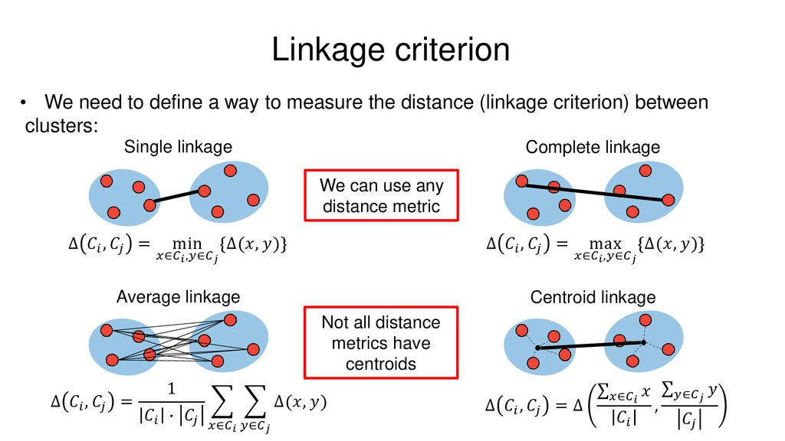
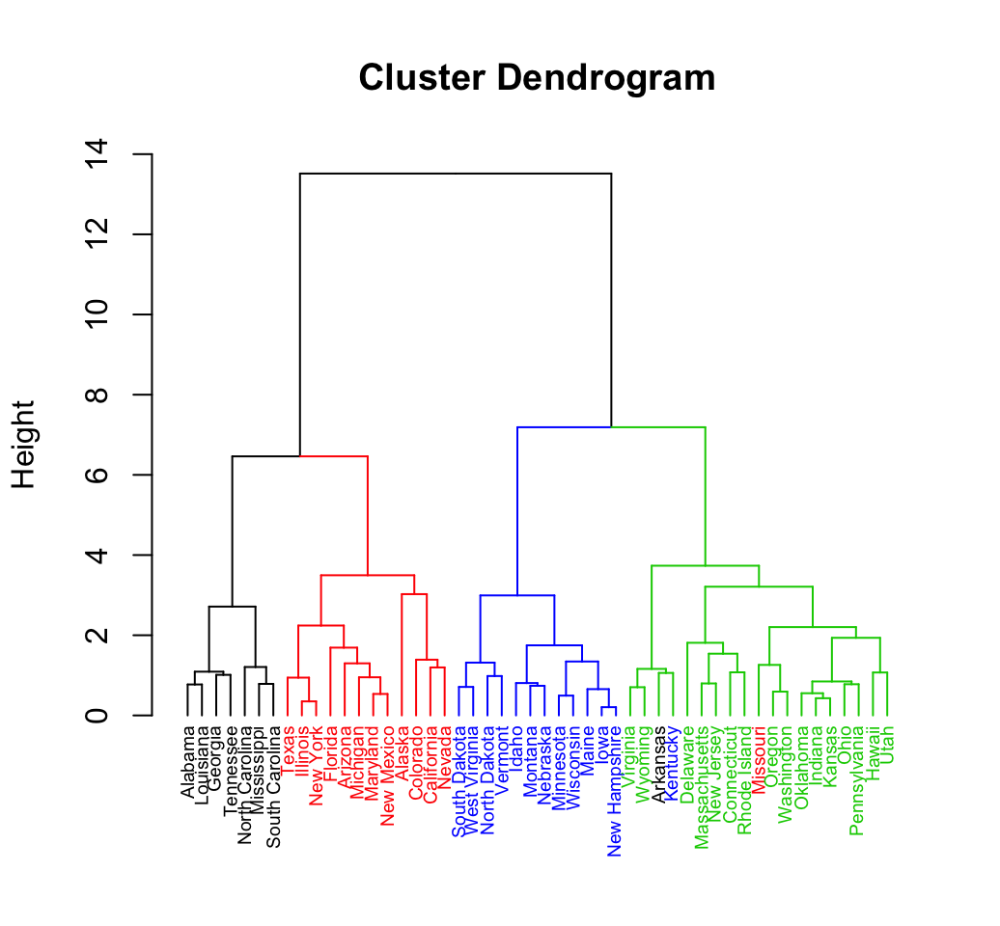
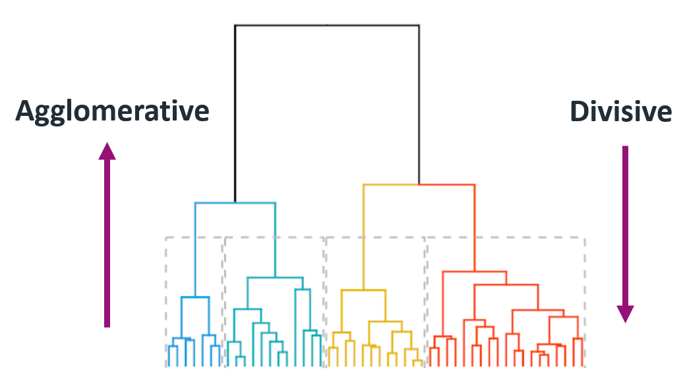

## Clustering

Clustering is an **unsupervised machine learning technique** used to group similar data points based on their characteristics. The objective is to ensure that:  
- Points within the same cluster are highly similar.  
- Points in different clusters are significantly different.


Unlike supervised learning, clustering doesn’t require predefined labels— rather it discovers patterns and structures in the data automatically.  

<br>


<br>

#### **Common Clustering Methods**
1. K-Means Clustering – Divides data into **k clusters** based on centroids.  
2. DBSCAN (Density-Based Clustering) – Forms clusters based on data density and detects outliers.  
3. Hierarchical Clustering – Builds a tree-like structure of clusters, useful when the number of clusters is unknown.  

<br>

---

<br>

## Introduction to Hierarchical Clustering
Hierarchical clustering stands out because it creates a nested hierarchy of clusters instead of assigning data to fixed groups. This hierarchy is represented using a **dendrogram**, which visually illustrates how clusters merge (or split) at different levels.  <br>

This method is particularly useful when:  
- You want to explore the natural structure of data.  
- The number of clusters is unknown.  

### How Hierarchical Clustering Works
Hierarchical clustering groups data points based on **similarity (or dissimilarity)** using a distance metric like:  
- **Euclidean Distance** (straight-line distance).  
- **Manhattan Distance** (sum of absolute differences).  
- **Cosine Similarity** (angle-based similarity for text data).

### **When to Use Hierarchical Clustering**
🔹 When the number of clusters is unknown.  
🔹 When you want to explore the natural hierarchy in data (e.g., biological classification).  
🔹 When working with small to medium datasets (hundreds to a few thousand points).  

It follows one of two approaches:  <br><br>


## **1. Agglomerative Hierarchical Clustering (Bottom-Up)**
### **How It Works**
1. **Start with each data point as its own cluster** (if you have `n` points, you start with `n` clusters).  
2. **Merge the closest clusters** step by step, forming larger clusters.  
3. **Repeat until all points belong to a single cluster.**  

### **Process**
- Compute the **distance between all points** (using a distance matrix).  
- Find the **two closest clusters** and merge them.  
- Update the **distance matrix** to reflect the new cluster.  
- Continue until only **one cluster remains**.  

### **Linkage Criteria (How to Measure Cluster Distance)**
When merging clusters, we need a **rule** to define their distance:  
- **Single Linkage** – Distance between the closest points of two clusters.  
- **Complete Linkage** – Distance between the farthest points of two clusters.  
- **Average Linkage (UPGMA)** – Average distance between all points in the two clusters.  
- **Centroid Linkage** – Distance between cluster centroids.  

<br>



<br>

### **Pros & Cons**
**Pros:**  <br>
- Intuitive and widely used.  
- Works well for **small datasets**.  

**Cons:**  <br>
- Computationally expensive (`O(n³)`) for large datasets.  

<br><br>

## **2. Divisive Hierarchical Clustering (Top-Down)**
### **How It Works**
1. **Start with all data points in a single cluster.**  
2. **Recursively split the cluster** into smaller groups.  
3. **Repeat until each data point is its own cluster** or meets a stopping criterion.  

### **Process**
- Begin with **one cluster** containing all points.  
- Use a **splitting method** (e.g., variance, distance) to divide it into **two clusters**.  
- Continue **splitting** until a **desired number of clusters** is reached.  

### **Pros & Cons**
**Pros:**  <br>
- Captures **large-scale structure** first.  
- More suitable for **top-down hierarchical data** (e.g., biological taxonomy).

  <br>

**Cons:**  <br>
- Requires a **good splitting strategy** (harder to define than merging).  
- Less commonly used than Agglomerative clustering.  

<br>

---

<br>

## **The Dendrogram**
A **dendrogram** is a tree-like diagram that **visualizes the clustering process**.  
- **Agglomerative Clustering:** Shows how clusters merge **from bottom to top**.  
- **Divisive Clustering:** Shows how clusters split **from top to bottom**.  

### **How to Use a Dendrogram**
- **Cutting at a higher level** → Fewer, **larger** clusters.  
- **Cutting at a lower level** → More, **smaller** clusters.  

<br>

<br>



<br>

<br>

## **Example**
<br>

### Given Data Points: A, B, C, D, E
<br>

#### **Agglomerative Clustering**
1. Find closest pair: A & B → Merge into (AB)
2. Find next closest: C & D → Merge into (CD)  
3. Merge (AB) with E → (ABE)  
4. Merge (ABE) with (CD) → (ABCDE) (final cluster).  

<br>


#### Divisive Clustering
1. Start with one cluster: (ABCDE)
2. First split: → (AB) and (CDE)  
3. Second split: → (C) and (DE)  
4. Continue splitting until each point is its own cluster.  

<br>

---

<br>


**Choosing Between Agglomerative and Divisive Clustering**:
- **Agglomerative** is more commonly used because it is easier to implement and interpret, especially when looking for natural groupings in data.
- **Divisive** is less common but can be useful when you want to break down a large dataset into smaller, more manageable segments.

Both methods use distance metrics to decide how to merge or split clusters, and the choice between them depends on the nature of the data and the specific goals of the analysis.


<br>

--- 

<br>


Let's perform **Hierarchical Clustering (Agglomerative and Divisive)** using the following dataset:  
**Data points** → {1, 5, 8, 10, 19, 20}  

We'll first create a **Proximity (Distance) Matrix** using the **Euclidean Distance** (absolute difference between values).  


<br>

<br>

## **Step 1: Proximity Matrix**
The proximity matrix represents the distance between each pair of data points.

|   | **1** | **5** | **8** | **10** | **19** | **20** |
|---|---|---|---|---|---|---|
| **1**  | 0  | 4  | 7  | 9  | 18  | 19  |
| **5**  | 4  | 0  | 3  | 5  | 14  | 15  |
| **8**  | 7  | 3  | 0  | 2  | 11  | 12  |
| **10** | 9  | 5  | 2  | 0  | 9   | 10  |
| **19** | 18 | 14 | 11 | 9  | 0   | 1   |
| **20** | 19 | 15 | 12 | 10 | 1   | 0   |

<br>

<br>

## **Step 2: Agglomerative Clustering (Bottom-Up)**
We start with **each point as its own cluster** and merge the closest ones step by step.

### **Merging Steps:**
1. **Closest points:** (19, 20) → Merge **{19, 20}**  
2. **Next closest:** (8, 10) → Merge **{8, 10}**  
3. **Next closest:** (5, 8, 10) → Merge **{5, 8, 10}**  
4. **Next closest:** (1, 5, 8, 10) → Merge **{1, 5, 8, 10}**  
5. **Final Merge:** ({1, 5, 8, 10}, {19, 20}) → **Single cluster**


<br>

### **Dendrogram Representation:**
```
1      5      8      10        19      20  
|      |      |       |         |       |  
------(8,10)        -----(19,20)  
      |                  |  
   ----(5,8,10)          |  
      |                  |  
    --(1,5,8,10)         |  
      |                  |  
      --------------------  
              |  
        (Final Cluster)
```


<br>

## **Step 3: Divisive Clustering (Top-Down)**
We start with **all points in one cluster** and **split** step by step.

### **Splitting Steps:**
1. **Initial cluster:** {1, 5, 8, 10, 19, 20}
2. **First split:** {1, 5, 8, 10} & {19, 20}
3. **Second split:** {1, 5} & {8, 10} in first cluster
4. **Third split:** {1} & {5} in first cluster; {8} & {10} in second cluster  
5. **Final clusters:** {1}, {5}, {8}, {10}, {19}, {20} (individual elements)


<br>

### **Dendrogram Representation:**
```
              (1,5,8,10,19,20)
                    |
        ------------------------
        |                      |
    (1,5,8,10)             (19,20)
       |                        |
   ----------                 ------
   |        |                 |    |
 (1,5)   (8,10)             (19) (20)
   |        |
 (1) (5)  (8) (10)
```

<br>

---

<br>

### **Comparison:**
| Feature | Agglomerative | Divisive |
|---------|--------------|----------|
| Start   | Each point as its own cluster | All points in one cluster |
| Process | Merge closest clusters | Split largest clusters |
| Result  | Builds up to a single cluster | Breaks down to single points |
| Complexity | Less expensive | More expensive |

<br>




<br>

### **Conclusion**
- **Agglomerative Clustering** is more common due to its efficiency.
- **Divisive Clustering** is useful when a **clear hierarchy of splits** is required.

