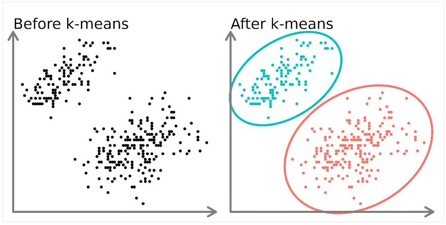
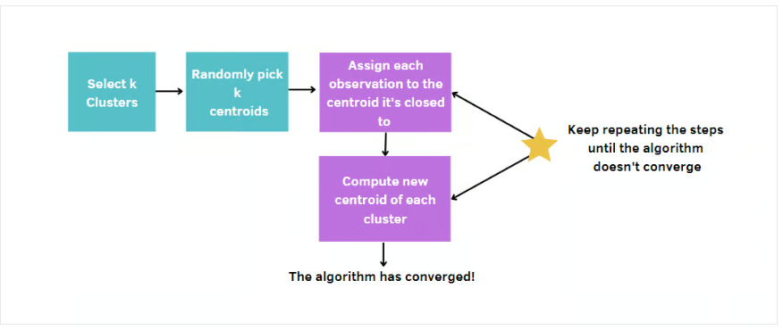

## K-Means Clustering

K-Means Clustering is an **Unsupervised Machine Learning algorithm** that groups an unlabeled dataset into different clusters. This article explores the fundamentals and working of K-Means Clustering along with its implementation.

<br>



<br>

#### **Understanding K-Means Clustering**
K-Means Clustering is a technique used to organize data into groups based on their similarity. For example, an online store might use K-Means to group customers based on purchase frequency and spending, creating segments like Budget Shoppers, Frequent Buyers, and Big Spenders for personalized marketing.

The algorithm works by first randomly picking some central points called **centroids**. Each data point is then assigned to the closest centroid, forming a cluster. After all points are assigned to a cluster, the centroids are updated by finding the average position of the points in each cluster. This process repeats until the centroids stop changing, forming stable clusters. The goal of clustering is to divide the data points into clusters so that similar data points belong to the same group.

### How K-Means Clustering Works
We are given a dataset of items with certain features and values for these features (like a vector). The task is to categorize those items into groups. To achieve this, we will use the K-Means algorithm. The ‘K’ in the name of the algorithm represents the number of groups/clusters we want to classify our items into.

### **Mathematical Explanation**
1. **Initialization**: Randomly select `k` points as initial centroids. <br> 
2. **Assignment Step**: Assign each data point to the nearest centroid using the **Euclidean distance**: <br> <br>
   $$\text{distance}(x_i, c_j) = \sqrt{\sum_{d=1}^{D} (x_{id} - c_{jd})^2}$$ <br> <br>
   where $$x_i$$ is a data point, $$c_j$$ is a centroid, and $$D$$ is the number of dimensions.
3. **Update Step**: Recalculate the centroids as the mean of all points assigned to each cluster: <br><br>
   $$c_j = \frac{1}{|C_j|} \sum_{x_i \in C_j} x_i$$ <br><br>
   where $$C_j$$ is the set of points in cluster $$j$$. <br><br>
4. **Repeat**: Continue the assignment and update steps until the centroids no longer change significantly.

### **Implementation of K-Means Clustering in Python**
We will use a blobs dataset to demonstrate how clusters are formed.

#### **Step 1: Importing the Necessary Libraries**
We are importing Numpy for statistical computations, Matplotlib to plot the graph, and `make_blobs` from `sklearn.datasets`.

```python
import numpy as np
import matplotlib.pyplot as plt
from sklearn.datasets import make_blobs
import matplotlib.pyplot as plt
from sklearn.datasets import make_blobs
```

#### **Step 2: Create the Custom Dataset with make_blobs and Plot It**
```python
X, y = make_blobs(n_samples=500, n_features=2, centers=3, random_state=23)

fig = plt.figure(0)
plt.grid(True)
plt.scatter(X[:, 0], X[:, 1])
plt.show()
```

#### **Step 3: Initialize the Random Centroids**
```python
k = 3
clusters = {}
np.random.seed(23)

for idx in range(k):
    center = 2 * (2 * np.random.random((X.shape[1],)) - 1)
    points = []
    cluster = {
        'center': center,
        'points': []
    }
    clusters[idx] = cluster
```

#### **Step 4: Plot the Random Initialized Centers with Data Points**
```python
plt.scatter(X[:, 0], X[:, 1])
plt.grid(True)
for i in clusters:
    center = clusters[i]['center']
    plt.scatter(center[0], center[1], marker='*', c='red')
plt.show()
```

#### **Step 5: Define Euclidean Distance**
```python
def distance(p1, p2):
    return np.sqrt(np.sum((p1 - p2) ** 2))
```

#### **Step 6: Create the Function to Assign and Update the Cluster Center**
```python
def assign_clusters(X, clusters):
    for idx in range(X.shape[0]):
        dist = []
        curr_x = X[idx]
        for i in range(k):
            dis = distance(curr_x, clusters[i]['center'])
            dist.append(dis)
        curr_cluster = np.argmin(dist)
        clusters[curr_cluster]['points'].append(curr_x)
    return clusters

def update_clusters(X, clusters):
    for i in range(k):
        points = np.array(clusters[i]['points'])
        if points.shape[0] > 0:
            new_center = points.mean(axis=0)
            clusters[i]['center'] = new_center
            clusters[i]['points'] = []
    return clusters
```

#### **Step 7: Create the Function to Predict the Cluster for the Data Points**
```python
def pred_cluster(X, clusters):
    pred = []
    for i in range(X.shape[0]):
        dist = []
        for j in range(k):
            dist.append(distance(X[i], clusters[j]['center']))
        pred.append(np.argmin(dist))
    return pred
```

#### **Step 8: Assign, Update, and Predict the Cluster Center**
```python
clusters = assign_clusters(X, clusters)
clusters = update_clusters(X, clusters)
pred = pred_cluster(X, clusters)
```

#### **Step 9: Plot the Data Points with Their Predicted Cluster Center**
```python
plt.scatter(X[:, 0], X[:, 1], c=pred)
for i in clusters:
    center = clusters[i]['center']
    plt.scatter(center[0], center[1], marker='^', c='red')
plt.show()
```

### **Evaluating Clusters: Silhouette Method**

The **Silhouette Method** is a technique used to evaluate the quality of clusters formed by a clustering algorithm like K-Means. It measures how similar each data point is to its own cluster compared to other clusters. The silhouette score for a data point is calculated as follows:

$$ s(i) = \frac{b(i) - a(i)}{\max(a(i), b(i))} $$

Where:
- \(s(i)\) is the silhouette score for point \(i\).
- \(a(i)\) is the average distance from point \(i\) to all other points in the same cluster (cohesion).
- \(b(i)\) is the average distance from point \(i\) to all points in the nearest different cluster (separation).

The silhouette score ranges from -1 to +1:
- **+1**: The point is well-clustered, meaning it is far from neighboring clusters.
- **0**: The point is on or very close to the decision boundary between two clusters.
- **-1**: The point is likely in the wrong cluster.

To determine the optimal number of clusters, calculate the average silhouette score for different values of \(K\). The best \(K\) is the one with the highest average silhouette score, indicating that the clusters are well-separated and each point is correctly grouped.

**Cons:**
- Can be computationally expensive for large datasets.
- May not work well if clusters are not spherical or have different densities.

### **Elbow Method**

The **Elbow Method** is a graphical tool used to determine the optimal number of clusters (\(K\)) in K-Means Clustering. It involves plotting the inertia (or cost) against the number of clusters and looking for an "elbow" point where the rate of decrease sharply changes.

**Inertia** is the sum of squared distances from each data point to the center of its assigned cluster. It measures how well the points are grouped in their clusters. The smaller the inertia, the better the clustering.

**Steps:**
1. Plot the inertia for different values of \(K\).
2. As \(K\) increases, inertia decreases because more clusters allow data points to be closer to their cluster centers.
3. The goal is to find the value of \(K\) where the decrease in inertia starts to slow down, forming an "elbow" in the plot. This point is considered the optimal value for \(K\).

The Elbow Method is widely used because it is simple to understand and provides a clear visualization of the optimal number of clusters.

**Key Takeaways:**
- **Elbow Method**: Use this method when you have a general sense of the data and want a quick visual way to estimate \(K\).
- **Silhouette Method**: Use this method when you want to evaluate how well-clustered your points are and how well-separated the clusters are.


<br>

---

<br>

### **Conclusion**
K-Means Clustering is a powerful unsupervised machine learning algorithm for grouping unlabeled datasets. Its objective is to divide data into clusters, making similar data points part of the same group. The algorithm initializes cluster centroids and iteratively assigns data points to the nearest centroid, updating centroids based on the mean of points in each cluster.

### **FAQs**
- **What is K-Means Clustering for Data Analysis?**  
  K-Means is a partitioning method that divides a dataset into ‘k’ distinct, non-overlapping subsets (clusters) based on similarity, aiming to minimize the variance within each cluster.

- **What is an Example of K-Means in Real Life?**  
  Customer segmentation in marketing, where K-Means groups customers based on purchasing behavior, allowing businesses to tailor marketing strategies for different segments.

- **What Type of Data is K-Means Clustering Model?**  
  K-Means works well with numerical data, where the concept of distance between data points is meaningful. It’s commonly applied to continuous variables.

- **Is K-Means Used for Prediction?**  
  K-Means is primarily used for clustering and grouping similar data points. It does not predict labels for new data; it assigns them to existing clusters based on similarity.

- **What is the Objective of K-Means Clustering?**  
  The objective is to partition data into ‘k’ clusters, minimizing the intra-cluster variance. It seeks to form groups where data points within each cluster are more similar to each other than to those in other clusters.
